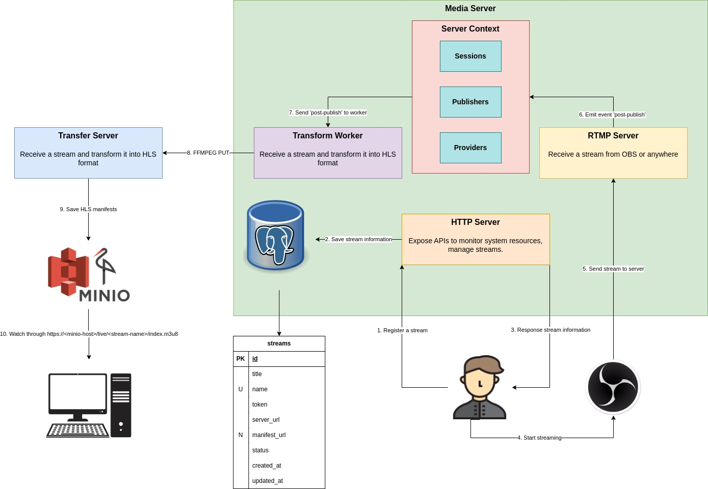

# Node Streaming



# 1. Features

- HLS over RTMP
- Multi resolution (480p - 2k)
- Minio Storage
- Monitoring

# 2. Installation

## 2.1. Media Transfer

- A middleware server for ffmpeg to put manifests to Minio Storage.
- This server should run locally with rtmp-node.

### 2.1.1. Quick start

```bash
# Install dependencies
yarn install

# Start project
node index.js
```

### 2.1.2 Environment Variables

- `MINIO_BUCKET`: Bucket where manifests are stored in - Default `live`
- `MINIO_ENDPOINT`: Minio host - Default `localhost`
- `MINIO_ACCESS_KEY`: Access key
- `MINIO_SECRET_KEY`: Secret key
- `MINIO_SSL`: Enable ssl (should be true if endpoint is not local) - Default `false`

### 2.1.3. API

```
PUT http://localhost:5333/<minio-key>
Body <binary>
```

## 2.2. Node RTMP

### 2.2.1. Quick start

> **_NOTE:_** Before installing this project, you must install and run **`media-transfer`** server first.
> After that, following these commands below to install

```bash
# Install ffmpeg
sudo apt update && sudo apt install ffmpeg

# Install dependencies
yarn install

# Create database
yarn prisma migrate dev

# Start project
node index.js
```

### 2.2.2. Environment variables

- Database config:
  - `DATABASE_URL`: Postgres database url - Default `postgresql://localhost:5432/media?schema=public`
- HTTP server config:
  - `HTTP_PORT`: Http server port - Default `8000`
- RTMP server config:
  - `RTMP_PORT`: Server port - Default `1935`
  - `RTMP_URL`: Server public url - Default `rtmp://localhost:1935/live`
  - `RTMP_PING`: Ping millisecond to check connection - Default `60000`
  - `RTMP_PING_TIMEOUT`: Timeout in milliseconds of ping request - Default `30000`
  - `RTMP_CHUNK_SIZE`: Output chunk size in byte - Default `128`
  - `RTMP_AUTH_PUBLISH`: Enable authentication for publishing a stream - Default `false`
  - `RTMP_AUTH_PLAY`: Enable authentication for watching a stream - Default `false`
  - `RTMPS_PORT`: Secure port - Default `443`
  - `RTMPS_PRIVATE_KEY`: Absolute path to private key - Default `undefined`
  - `RTMPS_CERTIFICATE`: Absolute path to ssl certificate - Default `undefined`
- Minio config:
  - `MINIO_URL`: Minio base url where manifests are stored in - Default `http://localhost:9001`
- Transfer server config:
  - `MEDIA_TRANSFER_URL`: Transfer server to put manifests to Minio over HTTP request - Default `http://localhost:5333`

### 2.2.3. Event callbacks

```js
// Trigger before establishing a connection
app.on('pre-connect', (id, args) => {
  app.logger.info('[PreConnect]: SessionID=%s | Args=%o', id, args);
});

// Trigger after establishing a connection
app.on('post-connect', (id, args) => {
  app.logger.info('[PostConnect]: SessionID=%s | Args=%o', id, args);
});

// Trigger after connection is closed
app.on('done-connect', (id, args) => {
  app.logger.info('[DoneConnect]: SessionID=%s | Args=%o', id, args);
});

// Trigger before publishing a RTMP stream
app.on('pre-publish', (id, path, args) => {
  app.logger.info('[PrePublish]: SessionID=%s | Path=%s | Args=%o', id, path, args);
});

// Trigger after publishing a RTMP stream
app.on('post-publish', (id, path, args) => {
  app.logger.info('[PostPublish]: SessionID=%s | Path=%s | Args=%o', id, path, args);
});

// Trigger after a RTMP stream is closed
app.on('done-publish', (id, path, args) => {
  app.logger.info('[DonePublish]: SessionID=%s | Path=%s | Args=%o', id, path, args);
});

// Trigger before a user joins a RTMP stream
app.on('pre-play', (id, path, args) => {
  app.logger.info('[PrePlay]: SessionID=%s | Path=%s | Args=%o', id, path, args);
});

// Trigger after a user joins a RTMP stream
app.on('post-play', (id, path, args) => {
  app.logger.info('[PostPlay]: SessionID=%s | Path=%s | Args=%o', id, path, args);
});

// Trigger after a user closes a RTMP stream
app.on('done-play', (id, path, args) => {
  app.logger.info('[DonePlay]: SessionID=%s | Path=%s | Args=%o', id, path, args);
});
```

### 2.3.4 How to publish a stream from OBS

- Request to generate a streaming url

```bash
curl --location 'http://localhost:8000/api/streams' \
--header 'Content-Type: application/json' \
--data '{
    "title": "Test live 123"
}'
```

- Response of generating streaming url:

```json
{
  "server_url": "rtmp://localhost:1935/live",
  "name": "MKUWZ4UVWC",
  "token": "b5110adf21eb9cbe078d8c7d01aa"
}
```

- OBS configuration:
  - Go to `Settings`
  - Go to `Stream` tab
  - Choose:
    - Service: `Custom`
    - Server: `<server_url>`
    - Stream Key: `<name>?token=<token>`
  - Click `OK`
  - Click `Start Streaming`

### 2.3.5. Watching stream

- Go to [**video player**](https://videojs-http-streaming.netlify.app/?debug=false&autoplay=false&muted=false&fluid=false&minified=false&sync-workers=false&liveui=true&llhls=true&url=https%3A%2F%2Fd2zihajmogu5jn.cloudfront.net%2Fbipbop-advanced%2Fbipbop_16x9_variant.m3u8&type=application%2Fx-mpegurl&keysystems=&buffer-water=false&exact-manifest-timings=false&pixel-diff-selector=false&network-info=false&dts-offset=false&override-native=true&preload=auto&mirror-source=true&forced-subtitles=false)
- Enter source url `https://<minio-host>/live/<name>/index.m3u8`

## 5. Docker Compose

```bash
docker-compose up -d
```
